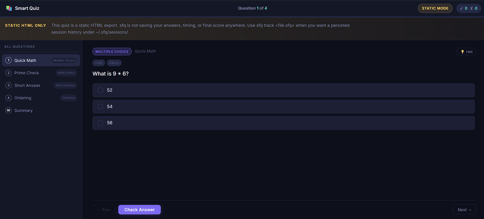

# sfq — StudyForge CLI

> AI-friendly CLI tool for generating interactive HTML quiz pages from `.sfq` files. Provides a schema for AI agent integration and a tracked quiz session mode for detailed performance insights.

This project is a personal experiment in building a simple quiz generator with a custom file format and CLI interface. The `.sfq` format is designed to be human-friendly and easy to write, while the generated HTML quizzes are interactive and visually appealing. The tracked session mode allows users to see detailed analytics about their quiz attempts, making it a useful tool for self-study or educational content creation.

Note: This was vibe coded as a helpful side tool. Take that for what you will :).



## Installation

```bash
go build -o sfq ./cmd/sfq
```

Or install directly:

```bash
go install ./cmd/sfq && export PATH="$(go env GOPATH)/bin:$PATH" && { grep -qxF 'export PATH="$(go env GOPATH)/bin:$PATH"' ~/.bashrc 2>/dev/null || echo 'export PATH="$(go env GOPATH)/bin:$PATH"' >> ~/.bashrc; }
```

## Quick Start

```bash
# Start a tracked quiz session on the local server
sfq track examples/sample.sfq

# Generate a static HTML quiz and open it in the browser
sfq generate examples/sample.sfq

# Generate static HTML without opening
sfq export examples/sample.sfq --output my-quiz.html

# Validate a .sfq file
sfq validate examples/sample.sfq

# Apply JSON edit operations to a quiz file
sfq edit examples/sample.sfq --ops edit-plan.json

# Open the last generated quiz
sfq open

# Show current state
sfq info

# Browse tracked quiz sessions
sfq history

# Inspect one session in detail
sfq results <session-id>

# Start a fresh session from a previous attempt
sfq retake <session-id>

# Print the full machine-readable schema (for AI agents)
sfq schema
```

## The `.sfq` File Format

An `.sfq` file consists of an optional header and one or more question blocks separated by `---`.

### Header (Optional)

```text
# My Quiz Title
author: Your Name
description: A short quiz about X.
```

### Question Block

```text
---
id: q1                           # optional — auto-generated as q1, q2, ...
type: multiple-choice            # see types below; inferred if omitted
title: "Short sidebar title"     # shows in navigation sidebar
hint: "A helpful hint."          # revealed on demand
tags: [tag1, tag2]               # optional categorisation

? Your question prompt goes here.
  It can span multiple lines and supports **markdown**.

- [x] Correct option
- [ ] Wrong option A
- [ ] Wrong option B

explanation: This explanation is shown after the user answers.
  It also supports **markdown**.
---
```

### Question Types

| Type | `type:` key | Choice syntax |
| --- | --- | --- |
| Multiple Choice | `multiple-choice` | `- [x]` correct, `- [ ]` wrong |
| Multi-Select | `multi-select` | `- [x]` correct (multiple), `- [ ]` wrong |
| True / False | `true-false` | `- [x] True` or `- [x] False` |
| True/False (Multi) | `multi-true-false` | `- [T] Statement` / `- [F] Statement` |
| Short Answer | `short-answer` | `answer: "Expected text"` |
| Ordering | `ordering` | `1. First`, `2. Second`, ... |

The type is **inferred automatically** if omitted:

- Two choices labelled "True"/"False" → `true-false`
- Multiple `[x]` choices → `multi-select`
- Any `[T]`/`[F]` markers → `multi-true-false`
- Numbered items → `ordering`
- No choices → `short-answer`
- Anything else → `multiple-choice`

## HTML Features

- **Mode banner** clearly showing whether the page is running in tracked mode or static mode
- **Sidebar** with all question titles for instant navigation
- **Progress bar** tracking answered questions
- **Keyboard navigation** — `←` / `→` arrows to move between questions
- **Hints** — revealed on demand
- **Per-question feedback** — correct/wrong highlighting with color-coded answers
- **Explanations** — shown after submitting
- **Score summary** at the bottom with percentage and breakdown
- **Fully self-contained** — no external dependencies, works offline
- **Dark mode** design

## Tracked Session Mode

Use `sfq track <file.sfq>` to launch the local HTTP quiz server instead of generating a static HTML file. This mode:

- records each submitted answer and time spent per question
- stores final scores and timestamps under `~/.sfq/sessions/`
- lets you inspect past runs with `sfq history` and `sfq results <session-id>`
- supports rerunning an earlier quiz with `sfq retake <session-id>`

`sfq generate` and `sfq export` are static modes. They produce a self-contained HTML file, but do not save answers or results for later retrieval.

## AI Agent Usage

Run `sfq schema` to get a full JSON description of every command, flag, and the `.sfq` syntax:

```bash
sfq schema | jq '.commands[].name'
```

The schema output is designed to be parsed by AI agents for tool-use contexts.

The schema explicitly marks static generation as the default mode for AI agents. Unless the user asks for saved results, tracking, or session history, agents should prefer `sfq generate` or `sfq export` over `sfq track`.

For editing quiz content, use `sfq edit` with a JSON operation plan instead of free-form text rewriting. This gives AI agents a deterministic and safer edit workflow.

Example edit plan:

```json
{
  "operations": [
    {
      "op": "set-header",
      "header": {
        "title": "Updated Quiz Title"
      }
    },
    {
      "op": "replace-question",
      "question": "q1",
      "data": {
        "id": "q1",
        "type": "multiple-choice",
        "title": "Refined question",
        "prompt": "Which number is even?",
        "choices": [
          { "text": "3", "correct": false },
          { "text": "4", "correct": true }
        ],
        "explanation": "4 is divisible by 2."
      }
    },
    {
      "op": "add-question",
      "data": {
        "id": "q-new",
        "type": "short-answer",
        "prompt": "What is the capital of France?",
        "answer": "Paris"
      }
    }
  ]
}
```

Apply it:

```bash
sfq edit examples/sample.sfq --ops edit-plan.json
```

## Project Structure

```text
study-forge/
├── cmd/sfq/
│   ├── main.go          # Entry point
│   └── commands.go      # All CLI commands (generate, export, open, validate, info, schema)
├── internal/
│   ├── parser/          # .sfq file parser
│   ├── editor/          # JSON operation editor for AI-safe quiz modifications
│   ├── generator/       # HTML generator + embedded template
│   ├── state/           # Persistent state (~/.sfq/state.json)
│   └── schema/          # MCP-like introspection schema
├── examples/
│   └── sample.sfq       # Demo file covering all question types
└── go.mod
```
